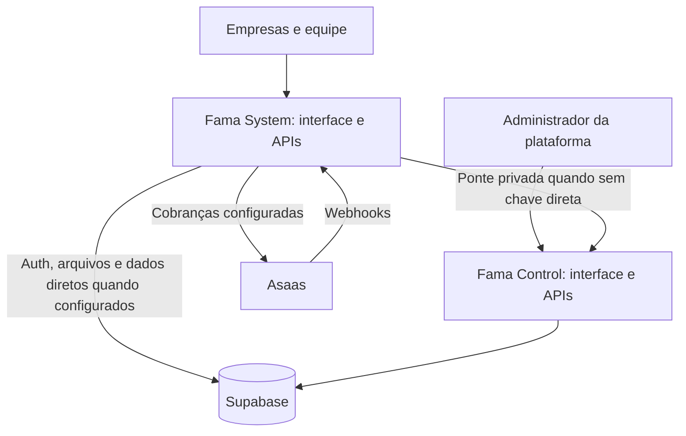

# Arquitetura

Fama System e Fama Control são duas aplicações com interfaces e APIs próprias. Elas compartilham Supabase para dados, autenticação e arquivos.

## Localização dos códigos

| Diretório da aplicação | Responsabilidade |
| --- | --- |
| `app/` | Páginas e componentes da experiência principal. |
| `app/api/` | Endpoints HTTP e autorização das operações. |
| `components/` e `hooks/` | Componentes e comportamento reutilizável. |
| `lib/` | Regras de negócio, persistência, integrações e geração de documentos. |
| `worker/` | Entrada Cloudflare e processamento das requisições. |
| `public/` | Logos, imagens, ícones e recursos públicos. |
| `db/`, `drizzle/` e `supabase/` | Modelos e migrações originais. |
| `tests/` | Testes e serviços simulados. |

## Dados e autenticação

As APIs verificam o usuário autenticado, a organização e suas permissões. Dados operacionais são associados à empresa. O Control administra empresas, membros e políticas de acesso; a presença do administrador da plataforma não deve substituir a autorização exigida para os dados operacionais.

O backend do Control possui o acesso administrativo necessário ao Supabase. O System pode usar acesso direto ou a ponte privada do Control, conforme as credenciais configuradas. O segredo de ponte pertence aos servidores. Os endereços que identificam a instalação estão inventariados em [DOMINIOS-E-PROPRIETARIO.md](DOMINIOS-E-PROPRIETARIO.md).

## Banco e runtime

`database/supabase/` contém a captura da estrutura compartilhada. Os SQLs históricos ficam junto de cada aplicação para preservar o funcionamento dos scripts originais. O D1 auxiliar continua vinculado pelo nome `DB`.

O build usa Vite/Vinext e produz um Worker ESM e arquivos estáticos. O runtime utiliza `cloudflare:workers`; transferir para outro tipo de servidor exige adaptar essas integrações.

As regras de gratuidade, cobrança opcional e bloqueio são verificadas pelos servidores, além dos controles apresentados no Control.
